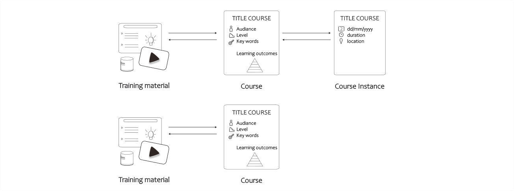
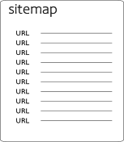

# What are the major bits and pieces OR How to mark up your content with Bioschemas?

[add-bioschemas file='docs/training-material.yaml']

{align=right}

Most webmasters are familiar with HTML tags on their pages. Usually, HTML tags tell the browser how to display the information included in the tag. For example, `<h1>Avatar</h1>` tells the browser to display the text string "Avatar" in a heading 1 (h1) format. However, the HTML tag doesn't give any information about what that text string "Avatar" means. It could refer to the hugely successful 3D movie, or it could refer to a type of profile picture. Missing a cleat definition can make it more difficult for search engines to intelligently display relevant content to a user.

In order to increase findability in web browsers [Schema.org](https://schema.org) provides a collection of shared vocabularies webmasters can use to mark up their pages in ways that can be understood by the major search engines: Google, Microsoft and alike.

You can use the [schema.org](https://schema.org) vocabulary along with the Microdata, RDFa, or JSON-LD formats to add information to your Web content. This guide will help get you up to speed with JSON-LD and Bioschemas so that you can start adding markup to your web pages.

Although this guide focuses on Bioschemas and JSON-LD objects. The basic ideas (types, properties etc.) introduced here are relevant beyond JSON-LD and apply for other markup with microdata or RDFa.

# Bioschemas profiles for training resources

Many training related resources will include pages describing tutorials or courses. As such, they are marked up using the following three profiles:

- `TrainingMaterial`: A profile describing training materials in life sciences, it can be used on its own (as it happens with the Bioschemas tutorials) or in combination with a `CourseInstance`.
- `Course`: A profile describing a course from a generic point of view, i.e., the learning objectives of a course rather than where and when it is delivered.
- `CourseInstance`: A profile describing a particular instance of a course, i.e., an edition of a course that is scheduled for specific dates and happening in a specific location (that of course can be online or on-site, virtual or real).

Note that the `CourseInstance` profile is used in tandem with the `Course` profile, i.e., a `CourseInstance` does not exist without a `Course` but a `Course` can exist without a `CourseInstance` (there are no current offerings of the course).

# Sitemap

{align=left}

A sitemap is a file where you provide information about the pages, videos, and other files on your site, and the relationships between them. Search engines like Google read this file to crawl your site more efficiently. A sitemap helps search engines discover URLs on your site.

The sitemap will be important so scrapers can find your pages and their metadata increasing the findability of the material.